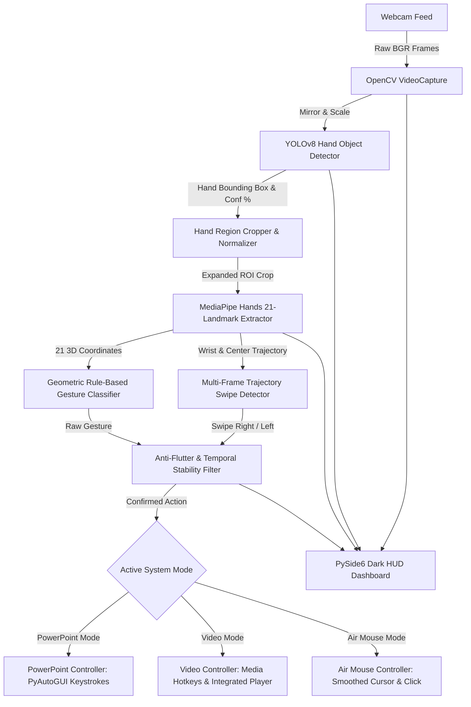

# AI-Based Hand Gesture Object Detection System
### Touchless PowerPoint and Video Control (YOLOv8 + MediaPipe Hands)


---

## 1. Project Overview

The **AI-Based Hand Gesture Object Detection System** is a real-time computer vision application designed for touchless human-computer interaction. Utilizing a live webcam feed, the system detects hands using **YOLOv8 object detection**, extracts 21 anatomical landmarks using **MediaPipe Hands**, performs rule-based geometric gesture classification, and translates gestures into seamless OS-level actions for:

1. **PowerPoint Presentation Slideshows** (Next/Previous slide, start/resume, pause/blank screen, exit)
2. **Video Playback** (Play/pause, forward/backward seeking, click/select in desktop media players or the built-in video player)
3. **Air Mouse Cursor Control** (Real-time index-finger mouse tracking, pinch-to-click, pinch-to-drag, and two-finger right click)

The system features a cyber-dark desktop dashboard built with **PySide6**, featuring real-time HUD overlays, telemetry metrics, an integrated video player demo tab, and a settings modal.

---

## 2. Problem Statement

Traditional presentations and video demonstrations frequently require the presenter to remain tethered to a physical keyboard, mouse, or presentation clicker. Existing gesture software often relies purely on landmark estimation or simple skin-color thresholding, leading to high false-positive rates when people, faces, or moving backgrounds appear in the camera frame.

By implementing a **two-stage vision architecture** that combines **YOLOv8 object detection** with **MediaPipe landmark analysis**, this system ensures:
- Robust hand localization before attempting landmark extraction.
- Scale-invariant and angle-invariant gesture recognition.
- High responsiveness (25–30+ FPS) on standard CPU hardware.
- Anti-flutter stabilization to eliminate accidental repeated commands.

---

## 3. How It Works: Two-Stage Vision Pipeline



### Stage 1: Object Detection (YOLOv8)
The frame is first evaluated by a fine-tuned lightweight YOLOv8 Nano model (`hand_yolov8n.pt`). YOLO outputs:
- Hand bounding box coordinates: $(x_1, y_1, x_2, y_2)$
- Detection confidence score: e.g., $96.4\%$
- Object label: `HAND`

### Stage 2: Landmark Detection (MediaPipe Hands)
The hand bounding box is expanded with a safety margin (to avoid clipping finger extensions and the wrist) and cropped from the frame. MediaPipe Hands then extracts:
- 21 3D landmarks (Wrist, CMC, MCP, PIP, DIP, and Fingertip coordinates for all 5 digits).
- Handedness classification (`Left` or `Right`) with confidence score.
- Landmark points are mathematically remapped back to full-frame space for visual rendering and screen cursor coordinates.

### Stage 3: Geometric Rule-Based Gesture Recognition
Normalized landmark coordinates are evaluated against anatomical geometric rules (finger extension ratios, inter-finger Euclidean distances, vertical orientation angles).

---

## 4. Implemented Gestures & Action Table

| Gesture | Visual | PowerPoint Mode | Video Mode | Air Mouse Mode |
| :--- | :---: | :--- | :--- | :--- |
| **Open Palm** | ✋ | Start / Resume Slideshow (`Shift+F5`) | Play / Resume Video (`Space`) | Release / Idle Mode |
| **Fist** | ✊ | Blank Screen / Pause (`B`) | Pause Video (`Space`) | Idle Mode |
| **Swipe Right** | 👉 | Next Slide (`Right Arrow`) | Seek Forward +5s (`Right Arrow`) | --- |
| **Swipe Left** | 👈 | Previous Slide (`Left Arrow`) | Seek Backward -5s (`Left Arrow`) | --- |
| **Pinch** | 🤏 | Select / Click (`Left Click`) | Click Playhead (`Left Click`) | Left Click / Drag & Drop |
| **Point Up** | ☝ | Switch to Cursor Mode | Cursor Mode | Move Cursor (Smoothed) |
| **Two Fingers** | ✌ | Right Click | Right Click | Right Mouse Click |
| **Thumb Up** | 👍 | Start / Resume Slideshow | Play / Resume Video (`Space`) | --- |
| **Thumb Down**| 👎 | Blank Screen / Pause | Pause Video (`Space`) | --- |

---

## 5. False-Positive Prevention & Safety

Accidental triggering is prevented through a multi-tier safety architecture:
1. **Consecutive-Frame Stability**: A gesture must be consistently recognized for $N$ consecutive frames (configurable, default 6 frames) before firing.
2. **Action Cooldown**: Once an action is triggered, an enforced delay (default 1.2s) locks out repeat actions until the gesture is released or changed.
3. **Multi-Frame Swipe Velocity**: Swipes require substantial horizontal displacement ($\Delta x \ge 16\%$ of frame width) where horizontal movement dominates vertical movement ($\Delta x > 1.35 \times \Delta y$) within a 0.12s–0.50s temporal window.
4. **Air Mouse Deadzone & EMA Smoothing**: Jitter is eliminated using Exponential Moving Average (EMA) coordinate filtering combined with a deadzone filter.

---

## 6. Project Structure

```
gesture-control-ai/
│
├── main.py                  # Main GUI entrypoint
├── requirements.txt         # Pinned Python package dependencies
├── README.md                # Full system documentation
├── config.py                # Configuration and model auto-download manager
├── run.bat                  # Windows one-click batch launcher
├── settings.json            # Local persistent user preferences
│
├── models/
│   ├── README.md            # Model provenance documentation
│   ├── hand_yolov8n.pt      # YOLOv8 nano hand detector weights (~6.2 MB)
│   └── hand_landmarker.task # MediaPipe hand landmark model bundle (~7.8 MB)
│
├── detection/
│   ├── __init__.py
│   └── yolo_detector.py     # Ultralytics YOLO inference wrapper
│
├── landmarks/
│   ├── __init__.py
│   └── hand_landmarks.py    # MediaPipe ROI cropper and coordinate mapper
│
├── gestures/
│   ├── __init__.py
│   ├── gesture_recognition.py # Rule-based geometric classifier & anti-flutter
│   └── swipe_detector.py    # Temporal trajectory swipe detector
│
├── controls/
│   ├── __init__.py
│   ├── powerpoint_controller.py # PyAutoGUI presentation shortcut dispatcher
│   ├── video_controller.py  # Media playback dispatcher & player bridge
│   └── mouse_controller.py  # Air Mouse cursor & pinch-drag handler
│
├── ui/
│   ├── __init__.py
│   ├── dashboard.py         # PySide6 cyber-dark workstation interface
│   ├── video_player.py      # Integrated PySide6 video player widget
│   └── settings_dialog.py   # Interactive configuration modal dialog
│
├── utils/
│   ├── __init__.py
│   ├── smoothing.py         # 2D coordinate exponential smoother
│   └── fps.py               # High-precision moving average FPS tracker
│
└── assets/
    ├── generate_sample_video.py # Demo video generator script
    └── sample_video.mp4     # Generated demo clip for testing
```

---

## 7. Installation & Setup

### Prerequisites
- Windows 10 / 11 (64-bit)
- Python 3.11+
- USB or integrated webcam

### 1. Clone or Open Workspace
```powershell
cd "c:\Users\kaush\OneDrive\Desktop\object detection\project 2"
```

### 2. Install Dependencies
```powershell
pip install -r requirements.txt
```

### 3. Automatic Model Verification
The application automatically downloads any missing model weights (`hand_yolov8n.pt` and `hand_landmarker.task`) upon first launch.

---

## 8. Running the Application

### Option A: Windows One-Click Launcher (Recommended)
Double-click `run.bat` or run:
```bat
run.bat
```

### Option B: Command Line
```powershell
python main.py
```

---

## 9. Demonstration Walkthrough

1. **Launch the Application**: Run `python main.py`. The dashboard opens in dark workstation mode and camera initialization begins automatically.
2. **Observe the Two-Stage Vision Pipeline**:
   - Hold your hand in front of the webcam.
   - The cyan bounding box with `HAND {conf%}` appears around your hand (YOLO Detection).
   - The 21 anatomical landmarks and skeleton lines appear over the fingers (MediaPipe Extraction).
   - Telemetry shows real-time inference latency (ms) for YOLO and MediaPipe.
3. **Test Video Mode**:
   - Click the `[ 🎬 Video Mode ]` button at the top (or in settings).
   - The dashboard automatically opens the **Built-in Video Player** tab with the bundled demo clip.
   - Show an **Open Palm** ✋ to start playing the video.
   - Show a **Fist** ✊ to pause the video.
   - Perform a quick horizontal **Swipe Right** 👉 in front of the camera to seek forward $+5$ seconds. Notice the glowing `>>> SWIPE RIGHT >>>` HUD banner.
   - Perform a **Swipe Left** 👈 to seek backward $-5$ seconds.
   - Show **Thumb Up** 👍 to play, or **Thumb Down** 👎 to pause.
4. **Test PowerPoint Mode**:
   - Click the `[ 📊 PowerPoint Mode ]` button.
   - Open any PowerPoint presentation (.pptx) or presentation window.
   - **Open Palm** ✋ starts the slideshow (`Shift+F5`).
   - **Swipe Right** 👉 moves to the next slide.
   - **Swipe Left** 👈 returns to the previous slide.
   - **Fist** ✊ pauses / blanks the screen (`B`).
5. **Test Air Mouse Mode**:
   - Click `[ 🖱 Air Mouse Mode ]`.
   - Point your index finger ☝ to smoothly steer the Windows mouse cursor across your desktop.
   - Pinch your thumb and index finger together 🤏 to click or drag items.
   - Show two fingers (peace sign) ✌ to right click.
   - Open your palm ✋ to release.
6. **Tune Settings**:
   - Click `[ ⚙ Settings ]` to adjust camera index, confidence thresholds, gesture stability frames, cooldown timers, or cursor sensitivity in real-time.

---

## 10. Troubleshooting

| Issue | Cause | Solution |
| :--- | :--- | :--- |
| **"Could not open camera device"** | Webcam in use by another app or invalid camera index | Close Zoom/Teams/OBS; open `Settings` in the app and change Camera Index from 0 to 1 or 2. |
| **Low FPS (< 20 FPS)** | High resolution or power-saving mode | Ensure laptop is plugged into power; verify YOLO is running on CPU/GPU cleanly. |
| **Gestures triggering too quickly / repeating** | Stability frame count too low | Open `Settings` and increase **Stability Frames** (e.g. from 6 to 9) and **Action Cooldown** (e.g. from 1.2s to 1.8s). |
| **Swipe not detecting** | Hand moved too slowly or diagonally | Perform a decisive horizontal swipe with your hand across the center of the camera frame. |

---

## 11. Future Enhancements

- **Two-Hand Bimanual Gestures**: Simultaneous two-hand zooming and rotation.
- **Custom Shortcut Mapper**: In-app UI allowing users to map arbitrary keystrokes and macros to each gesture.
- **Voice + Gesture Fusion**: Multimodal commands combining voice confirmation with gesture selection.
